## Research Logs

### 2026-07-15: Does SmolVLA run better if I increase scale

### 2026-07-15: Does SmolVLA run better if I increase scale
Short answer no. I'm able to observe a lot more per session though.

I thought I properly increased scale from 0.05 to 0.1, then 0.5. Turns out I was editing the wrong part of code and I have a bunch of frames for the same scale of 0.01, so I changed their names for future reference- might as well keep them for the sake of learning.
- Created better naming conventions for frames
- Started running IsaacSim not-headless because I have room for it VRAM wise now that I'm using SmolVLA (~6.4/8GB observed peak)

Actually changed scales.
#### Scale factor sweep (instruction: "pick up the blue cube")

| Scale | Cube interaction (Y/N) | Notes |
|-------|:----------------------:|-------|
| 0.05  | N | The arm is just awkwardly moving itself "up"    |
| 0.15  | N | The arm did make a better attempt to move itself down towards the cube but did not meet the EE with the cube. This was the closest it got. |
| 0.5   | N | The arm was just as awkward as the first scale, and this time rotated away from the cube then back down. It was making a lot of adjustments, and it was doing a lot more within the time frame but still did not meet the cube.

| Scale 0.05 | Scale 0.15 | Scale 0.5 |
|--------|---------|---------|
| 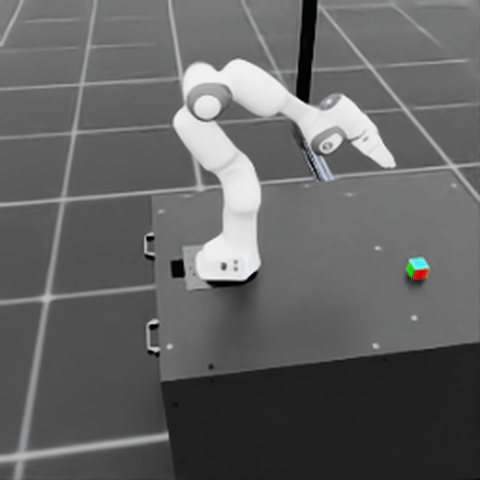 | 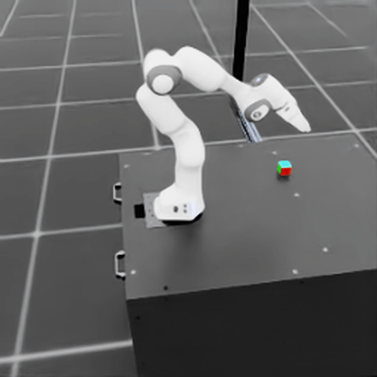 | 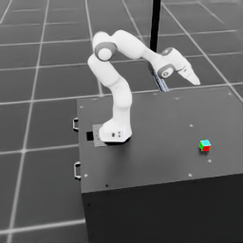

This is the first time I'm seeing that the VLA is doing different solutions every time, not just one solution every time I run it. It's trying different things because a lot of the information I'm giving it is OOD.

Bottom line, this needs:
- I need to actually give joint state back to SmolVLA
- ability to open and close the gripper
- a different arm would be best
- maybe better camera angles or just more cameras given that SmolVLA would do well with 3 inputs

### 2026-07-11: It's aliiiiive! Success: Closed loop SmolVLA driving IsaacSim Franka arm on RTX 3070 8GB
I successfully ran inference closed loop, demonstrating the architecture end to end.

IsaacSim takes a "photo" of the simulated Franka arm on a table with a cube -> POSTs image to SmolVLA server -> server processes one image at a time through SmolVLA -> server spat out an action back to IsaacSim client-> IsaacSim received the action -> bot moves -> start loop again.

I can see the arm moving subtly by moving through the saved images in this project (see below)

#### VLA + IsaacSim finally fit on RTX 3070 8GB

| Configuration                              | VRAM (observed peak) | Result            |
|--------------------------------------------|----------------------|-------------------|
| OpenVLA (4-bit) server + Isaac Sim headless | 7.2 / 8.2 GB         | Crash (OOM)       |
| SmolVLA server alone                        | 1.9 / 8.2 GB         | —                 |
| SmolVLA server + Isaac Sim headless         | 5.8 / 8.2 GB         | Closed loop runs  |

#### Commands
Assume cd into project root.
1. Activate server in terminal: `conda activate lerobot` then `python scripts/smolvla_server.py`
2. Activate IsaacSim in another terminal: `conda activate isaaclab` then `python scripts/closed_loop_smolvla.py`

#### Some things I need to address
1. The Franka arm isn't the best choice for SmolVLA; SmolVLA outputs joint-space commands for an SO-100 which I feed into an EE-delta (IK-Rel) interface on a Franka.
2. Camera placement; SmolVLA wants 3 camera inputs and one of them is egocentric on the EE; I'm using a weird angle (see frames below).
3. Number of cameras; I'm only simulating one camera, so I duplicate the frame to fill in the other two expected camera frames.
4. SmolVLA wants 6DOF joint state as part of it's input; I am not giving any state and just zeroing all that out.
5. No fine tuning (not a hack but will help immensely)
6. The arm moves slowly in observation; scale factor 0.05 in closed_loop.py; try 0.1-0.2.
7. The full 200 step run took around 5s which when I asked Claude about this, it flags as unusually fast for that many inferences. Investigate this.

#### Closed-loop frame sequence (every 20 steps, instruction: "pick up the blue cube")
This only ran for around 5 seconds. Next step is to either speed things up by adjusting a scale or sensitivity, or let it run longer. SmolVLA's 6 outputs -> first 6 dims of the 7-dim IK-Rel action × 0.05, gripper pinned open.

| Step 0 | Step 20 | Step 40 | Step 60 | Step 80 |
|--------|---------|---------|---------|---------|
| 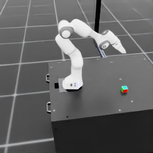 | 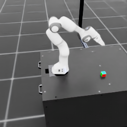 | 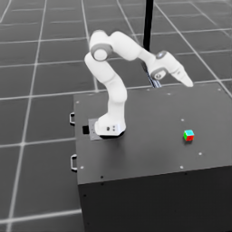 | 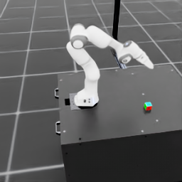 | 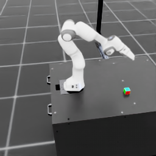 |

| Step 100 | Step 120 | Step 140 | Step 160 | Step 180 |
|----------|----------|----------|----------|----------|
| 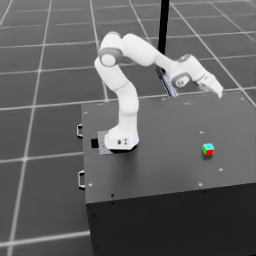 | 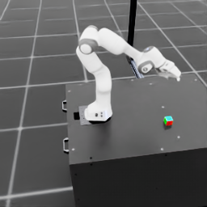 | 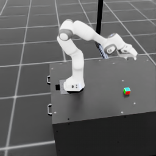 | 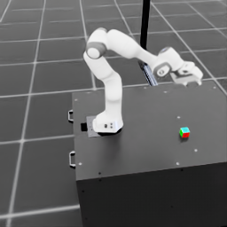 | 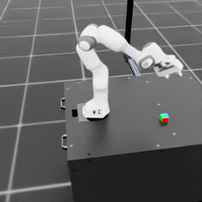 |

### 2026-07-10: Attempted closed loop OpenVLA; pivot to SmolVLA due to GPU mem constraint (8GB)
##### Biggest finding: SmolVLA takes up significantly less VRAM on my RTX 3070: 2047MiB / 8192MiB observed peak when running inference!
I attempted to get a basic flask server running to get a closed loop inference on quantized (4bit) OpenVLA with IsaacSim Franka and a cube. This failed because I kept running into memory issues having the quantized model running then attempting to run a headless IsaacSim instance to give the model server a frame to analyze. I even dumbed down the simulated camera resolution to 256x256, unplugged all but one monitor, closed all unnecessary apps, and it still wasn't enough. I made the decision to try and move to SmolVLA which should be better given that it seems to have been made with consumer hardware memory constraints in mind.
- With quantized OpenVLA server running and headless IsaacSim, it takes up around 7.2/8.2GB on my RTX 3070 and that's including the fact that IsaacSim returns failures. Maybe it would be even more if it had the room.
- I'm still going to have a local server running to get this to work closed-loop; flask server running the VLA <--> IsaacSim Franka with cube

#### SmolVLA inference success
##### Biggest finding: SmolVLA takes up significantly less VRAM on my RTX 3070: 2047MiB / 8192MiB observed peak when running inference!
I configured a conda env for SmolVLA and got it inferring from the same simulated frame I was using on OpenVLA the other day. It returns a 6 DOF joint space action. I'll have to adjust the workflow though because SmolVLA has different inputs/outputs than OpenVLA:
- SmolVLA likes an input of a 3-item dict; [3 camera frames, 6DOF joint state, instruction] which is different than what OpenVLA wanted; [1 camera frame, instruction]
- SmolVLAs output is also a 6DOF joint state that it post processes to a tensor

I ran a SmolVLA test on the same image from last time when I got OpenVLA inferring on an IsaacSim image: 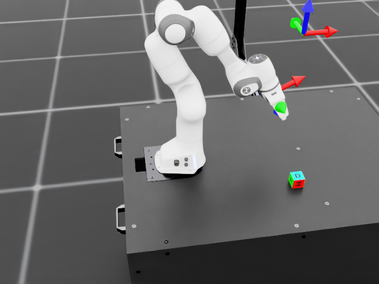

It gave the following output: `torch.Size([1, 6]) tensor([[ 0.0941, -0.0266,  0.1428, -0.2455,  0.1304,  0.5694]])`
I used smolvla_test.py which was developed with Claude as I figured out how to trick SmolVLA into thinking it's getting 3 camera feed frames when I'm only giving it one.

Next step is closed loop with IsaacSim!

### 2026-07-08: Ran OpenVLA inference on IsaacSim simulated frame
 Grabbed a tutorial script from IsaacLab that shows how to get sensors to work, created `capture_frame.py` to get IsaacSim to simulate a Franka arm with a cube on a table, then set the camera to save a frame to the project. Then ran the inference to pull the frame and determine a movement tensor to pick up the cube.
 - Had to do a lot of fussing with the simulated camera (why does it ship with such high sensitivity when navigating the 3D world?!)
 - Had to realize that OpenVLA was trained on a certain angle for the camera meaning an optimal location was a good idea
 - Running the sim headless was best for my poor GPU
 - Changed the inference code prompt to `prompt = "In: Pick up the blue cube\nOut:"` even though the cube is actually multicolored, I just wanted to see what would happen. I got back an action tensor successfully, I just don't know what that would look like. (Predicted 7-DOF action: [-0.00065614 -0.0111082  -0.00154037  0.01391019  0.02668386 -0.05970324 0.])

 Achieved:
 Isaac Lab scene in Isaac Sim -> camera frame -> OpenVLA -> 7 DOF action tensor

### 2026-07-07: Ran OpenVLA inference (quantized for my RTX3070) on real photo; SmolVLA is next to compare
Loaded up and ran inference on OpenVLA (quantized so it fits on my 3070). Giving it a real image of a cup on my desk and then later comparing it to SmolVLA which fits better on my GPU.
- Had to fuss with a lot of mismatched libraries because I was trying to run a quantized model from 2024 on libraries from now.
- Worked with Claude to find that OpenVLA actually recommends to just have a dedicated conda env for era-correct libs
- Discovered that inputs need to match the weights (in my case my processor was creating an image tensor in 32 when the model weights are set to 16)
- Learned a bunch of things in the process so I'm blurry on some things like timm, how bitsandbytes works....

I used the prompt `prompt = "In: What action should the robot take to pick up the mug?\nOut:"` and got the output `Predicted 7-DOF action: [ 1.48869192e-05 -1.95259519e-02  1.83735840e-03  1.51873807e-02
 -5.10204509e-02 -9.51627977e-02  9.96078431e-01]` when I gave it a sample image of my nasa mug on my table.

 I'll need to figure out exactly what each number means.

 A few notes:
 OpenVLA inference runs in a separate openvla conda env (Python 3.10) with era-pinned libraries — see requirements-openvla.txt.

### 2026-07-03: PyTorch quickstart completed
Worked through the PyTorch quickstart tutorial (FashionMNIST classifier).
Built conceptual understanding of:
- Model definition with nn.Module, forward pass, and layer stacking
- Weights vs. biases and how each is learned via gradient descent
- Cross-entropy loss and softmax for classification
- Training vs. evaluation modes, batch size, epochs
- Why VRAM matters and how parameters map to memory

### 2026-5-24: Initial environment setup
- Ubuntu 22.04 dual-boot completed
- NVIDIA driver 580 verified via `nvidia-smi`
- conda + Python 3.11 env created (`isaaclab`)
- PyTorch CUDA confirmed: `torch.cuda.is_available() == True`, RTX 3070 detected
- Isaac Sim 5.1.0 installed via pip
- Isaac Lab cloned and installed
- Smoke test passed: `Isaac-Lift-Cube-Franka-v0` task launches and runs RL training
- Known noise: pip dependency conflicts on psutil, click, torchaudio — not blocking
- Observation: Isaac Sim startup is heavy on 3070; reducing monitor count helps