## Research Logs

### 2026-08-22: Can SmolVLA pick up the cube zero shot using the SO-100/SO-101 arms? (pt. 3)

Today I'm testing whether or not the adjustments made last session meaningfully allow SmolVLA to pick up the cube using SO-100/101 arms ("Pick up the blue cube").

#### Attempt 1 - no change from last session (SO-100)
First pass without changing anything from last session; the arm fails. My guess is that we need to give SmolVLA a true 3-camera solution instead of duplicating the 3rd person view for the 3rd camera.

| Front Right Cam (attempt 1) | Wrist Cam (attempt 1) |
|---------------------|---------------------|
| 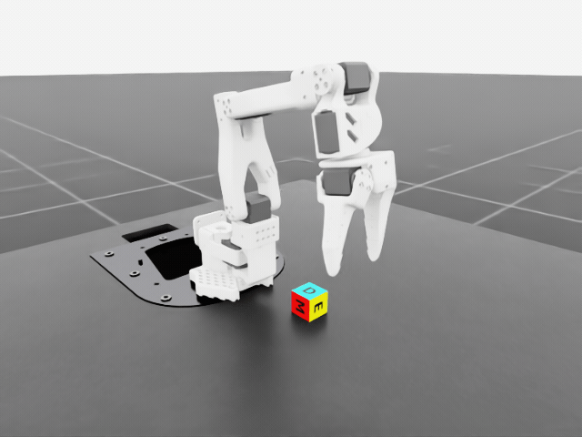 | 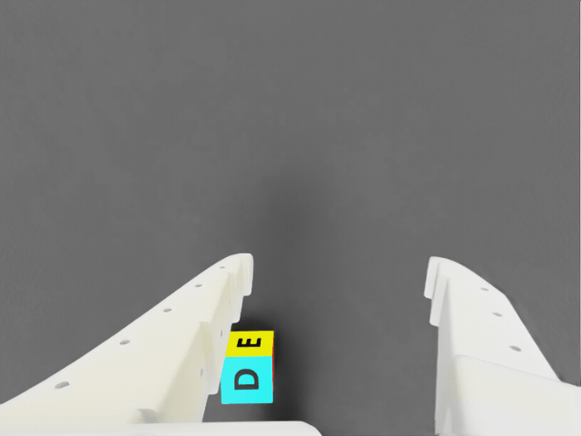 |

#### Attempt 2 - add a 3rd camera view (SO-100)
I added front-left cam to see if there was a meaningful difference. There was not. I'm keeping this setup moving forward, but it was not the fix. The gripper is moving fine but not the joints. Will be swapping the arm for SO-101. 

| Front Right Cam (attempt 2) | Wrist Cam (attempt 2) | Front Left Cam (attempt 2) |
|---------------------|---------------------|---------------------|
| 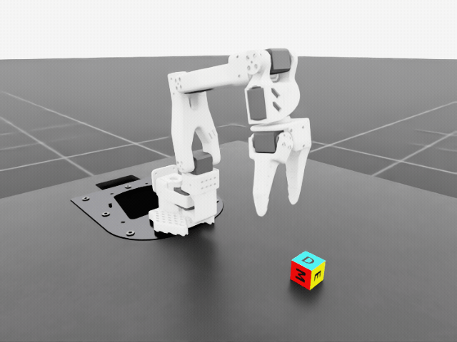 | 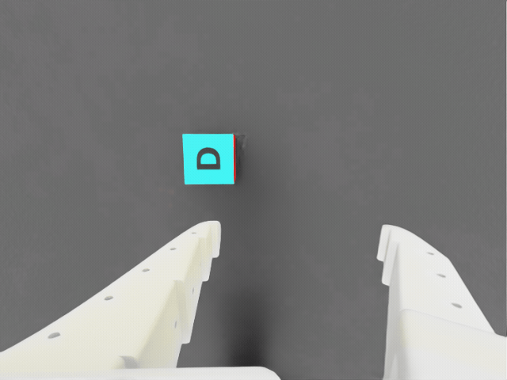 | 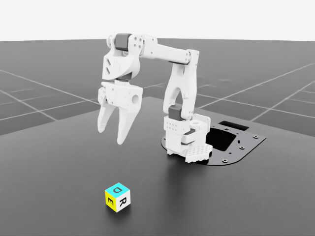

#### Attempt 3 - swap to SO101 arm (SO-101)
This also did not help. Even though the cube spawned outside of the wrist's camera, the other cameras showed it and it should have at least moved the joints other than the wrist. I think this narrows down the issue to the joints themselves.

I'm going to investigate the base rotation first.

| Front Right Cam (attempt 3) | Wrist Cam (attempt 3) | Front Left Cam (attempt 3) |
|---------------------|---------------------|---------------------|
| 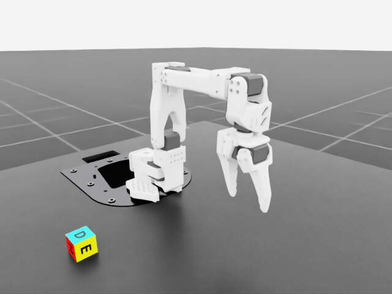 | 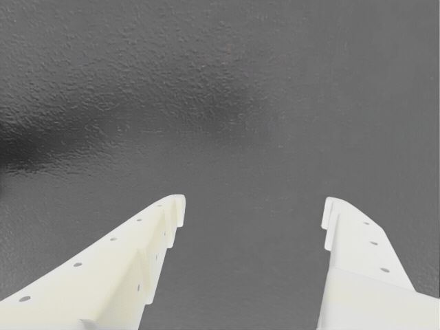 | 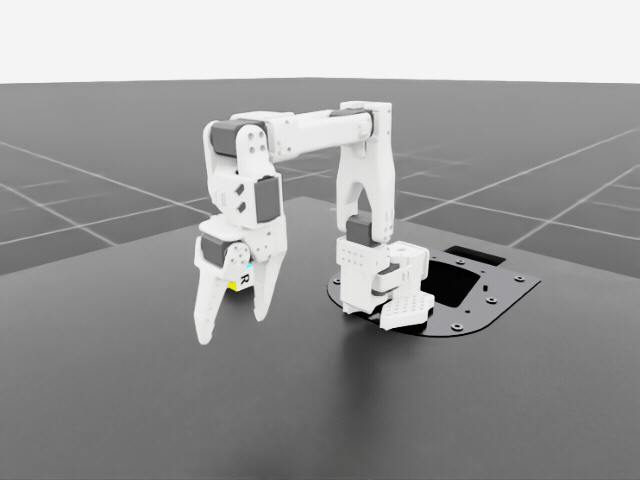

#### Attempt 4 - fixed action unnormalization + delta vs absolute (SO-101)
I used Claude to investigate the base rotation. It wasn't the rotation — there were two separate bugs in how an action gets from SmolVLA into Isaac, and both were making the arm barely move.

**1. Actions were never unnormalized (the big one).** SmolVLA is trained on z-scores, not real units, so the postprocessor is supposed to convert its output back with `real = z * std + mean`. The checkpoint stores its stats under keys like `so100.buffer.action.mean`, but the loader splits each key on its *last* dot and then looks the feature up as `action` — so nothing ever matched, and the unnormalizer silently passed the raw z-score straight through. My code then called `deg2rad` on that z-score as if it were already degrees. For wrist_roll (mean -27.42, std 59.36) a model output of 2.8 should have become `-27.42 + 2.8*59.36 = 139°`; instead it was used as 2.8°. Roughly 50x too small, no error or warning anywhere. This has been wrong since the first SO-100 run on 2026-07-30.

**2. Absolute vs delta.** Note the direction here — Isaac wasn't *emitting* deltas. The state I send SmolVLA (`data.joint_pos`) was absolute all along. It's the action side: Isaac's `arm_action` term *consumes* what I send as `target = 0.5 * action + rest_pose`, so it read SmolVLA's absolute joint targets as half-strength nudges away from rest. Fixed with `scale=1.0` and `use_default_offset=False`.

Result: the arm genuinely articulates now instead of twitching — mean pixel change from step 0 to step 180 went from 1.32 (attempt 3) to 13.52. It still does not grasp the cube.

**Caveat on this run:** with `use_default_offset=False`, a zero action no longer means "hold position", it means "go to joint zeros" — so my 50 settle steps now drive the arm before inference even starts. Step 0 here is already 10.3 away from the true rest pose, vs 3.5 in attempt 3. Some of the motion in these gifs is the settle phase, not SmolVLA. Need to settle with `default_joint_pos` and rerun before treating this as a clean measurement.

| Front Right Cam (attempt 4) | Wrist Cam (attempt 4) | Front Left Cam (attempt 4) |
|---------------------|---------------------|---------------------|
| 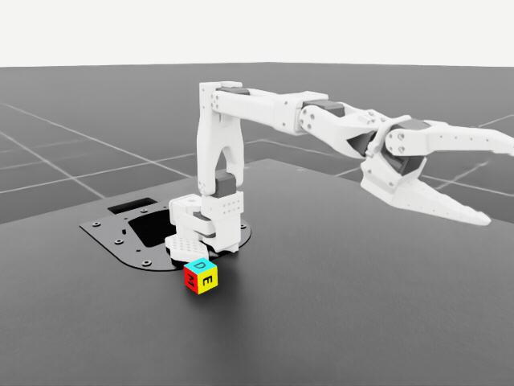 | 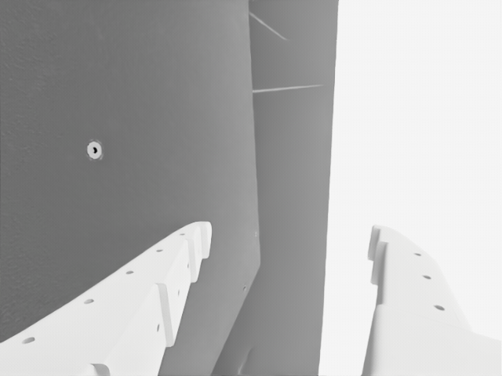 | 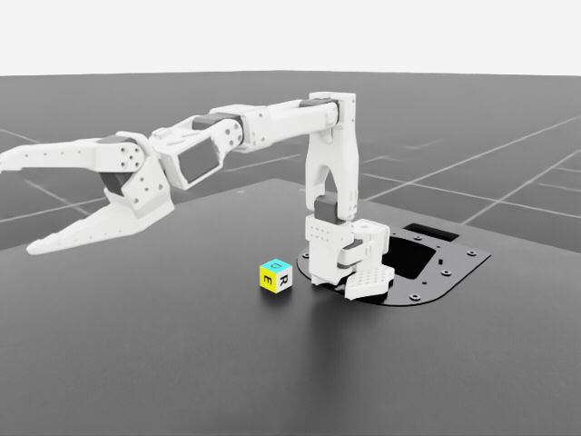

### 2026-08-03: Can SmolVLA pick up the cube zero shot using the SO-100/SO-101 arms? (pt. 2)

Hypothesis from last session: The camera position, arm colors, and large axis arrows on the arm were throwing the system further from distribution. 

| Arm before using AI to optimize |
|---------------------|
| 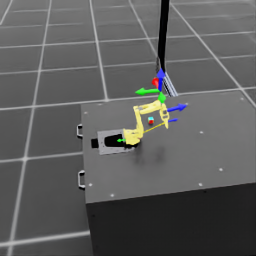 |

Today I used Claude code to change those to better match SmolVLA's training data to see if there's subjective improvement in picking up a cube.

All the scene-matching logic now lives in `scripts/smolVLA/arm_SO-100/scene_match.py` so the closed loop stays readable and I can A/B settings from the CLI.

#### What was actually OOD

Looking at the 2026-07-30 frame again, Claude found the following:

1. **Debug-vis markers.** The lift task ships `debug_vis=True` on both `scene.ee_frame` and `commands.object_pose`, which paints big saturated RGB axis triads directly over the gripper. Zero training frames contain those. This was sitting right on top of the thing the model needs to look at. Off now.
2. **Camera.** I was 1.4 m away with a 47° lens aimed at the origin — a leftover from the Franka scene. The arm was cropped and tiny. Community SO-100 rigs are a webcam ~0.4–0.6 m out, 0.25–0.45 m above the table, angled down 20–40°, whole arm in frame.
3. **Aspect ratio.** This one I did not expect. SmolVLA's config sets `resize_imgs_with_padding=(512,512)`, and `resize_with_pad` in `modeling_smolvla.py` does an aspect-preserving resize then pads **left and top**. A real 640×480 recording therefore reaches SigLIP as 512×384 content with a 128 px black bar on top. My 256×256 square render produced **no bar at all**. Verified directly against lerobot's own function:

   | render | to_tensor | after pad-resize | top letterbox |
   |--------|-----------|------------------|:-------------:|
   | new 640×480 | (1,3,480,640) | (1,3,512,512) | **128 px** |
   | old 256×256 | (1,3,256,256) | (1,3,512,512) | 0 px |

   So I render 4:3 now and stopped squashing to square in the server — the policy does its own resize, and letting it do so reproduces the letterbox it trained on.
4. **Arm color.** `so_arm100.urdf` defines `3d_printed` as rgba(1.0, 0.82, 0.12) — saturated yellow. Community SO-100/101 builds are overwhelmingly white or black PLA with black STS3215 servos. The `sts3215` material was already correct at (0.1, 0.1, 0.1).

Also checked and found **fine**, so I can stop worrying about them: `smolvla_base`'s own `config.json` declares exactly `camera1/2/3`, so my key names were right all along, and `normalization_mapping` has `VISUAL: IDENTITY` — images aren't normalized with dataset stats, so there are no per-camera stats to mismatch and the three slots are interchangeable.

#### Camera

Presets are in `scene_match.CAMERA_PRESETS`, all aimed at a target ~0.12 m above the table (aiming at the cube itself dumped a third of the frame into empty foreground and clipped the arm off the top edge — see `frames/2026-08-03_camera-preview_firstpass/`). FOV is set in degrees via `focal_length_for_hfov()` rather than raw focal length; 68° is Logitech-webcam-ish, vs. the 47° I had.

| preset | distance | elevation | notes |
|--------|:--------:|:---------:|-------|
| `front_right` **(default)** | 0.47 m | 20° | 3/4 from the arm's right. Closest to the median community rig. |
| `front_left` | 0.47 m | 20° | Mirror. Worth testing — the training mix isn't left/right symmetric. |
| `front` | 0.49 m | 30° | Head-on. Best gripper-height read, weakest depth cue on y. |
| `high_front` | 0.48 m | 45° | Better cube visibility, more foreshortened arm. |
| `low_front` | 0.48 m | 10° | Laptop-webcam height. |
| `legacy` | 1.93 m | 42° | The 2026-07-30 pose, kept for A/B. |

I also added a **wrist camera** parented to the `gripper` link (the fixed jaw — `jaw` is the moving one), which is what the training rigs actually have and what I'd been faking by duplicating the third-person view into all three slots. It looks down the jaw axis (−y in that link's frame) with a 20° downward tilt so the grasp point lands near frame centre; at 0° tilt the jaws sat in the bottom corners and most of the frame was bare table. Slot assignment is now camera1 = third-person, camera2 = wrist, camera3 = third-person duplicate.

| before (2026-07-30) | after: `front_right` | after: wrist cam |
|---------------------|----------------------|------------------|
|  | 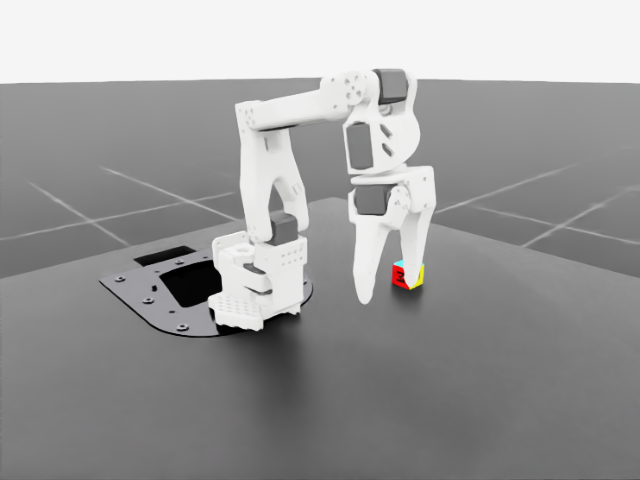 | 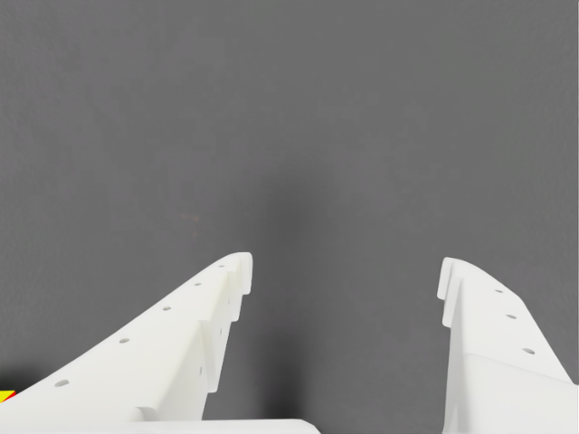 |

`preview_scene.py` also writes a `_pad.png` next to each frame — that's the actual 512×512 tensor SigLIP receives, black bar and all. Those are the ones to compare against real dataset frames.

#### Arm color

Repainted at runtime on the USD stage rather than editing the vendored URDF, so my `isaac_so_arm101` checkout stays clean and there's no URDF→USD reconversion. Useful gotcha: the importer logs `The path 3d_printed is not a valid usd path, modifying to a_d_printed`, so a name match on `3d_printed` finds nothing — `recolor_arm()` falls back to matching the URDF's source RGB, which is what actually catches it. `list_arm_materials()` dumps every shader if that ever needs debugging.

Servos are left black. Note that a black arm renders mid-gray in the preview because the RTX auto-exposure lifts the whole frame when the scene darkens — the recolor is applied, it just doesn't look as dark as (0.05, 0.05, 0.05) suggests.

#### Correction to the 2026-07-30 notes

The wild changes in steps 51 and 68 in last session's action log was numpy switching the whole array to scientific notation because one element dropped below 1e-4. Printed with `.round(4)` the two steps are nearly identical:

```
step 50: [ 0.0055  0.0038 -0.0015 -0.0123  0.095  -0.0174]
step 51: [ 0.004   0.0062 -0.0001 -0.0146  0.0889 -0.018 ]
```

So the policy was smooth throughout, not erratic. The real observation stands: every action was tiny (~0.6–5°), which is why the arm barely moved.

#### Related finding: I'm only running 4 inferences per 200-step run

`select_action` pops from an action queue and only re-runs the model when the queue empties (`_check_get_actions_condition` returns `len(queue) == 0`). With `chunk_size = n_action_steps = 50`, a 200-step run does **4** real inferences — the other 196 steps replay queued actions. This is what made the 200-step run on 2026-07-11 finish in ~5 s, which I'd flagged as suspiciously fast.

It matters for reading today's results: better images only reach the model at steps 0, 50, 100, 150. Not changing it today, but worth testing `n_action_steps` lower (or `predict_action_chunk` with RTC) in a future session.

#### Terminal Commands
Assume cd into project root.
1. `conda activate lerobot` then `python scripts/smolVLA/arm_SO-100/smolvla_server.py`

Start separate terminal.

2. `conda activate isaaclab` then `python scripts/smolVLA/arm_SO-100/closed_loop.py`

Flags on `closed_loop.py`: `--preset` (default `front_right`), `--arm-color {white,black,yellow}` (default `white`), `--no-wrist`, `--steps`.

Camera/color sweep without the server, writes to `frames/<date>_preview_<n>/`:
`python scripts/smolVLA/arm_SO-100/preview_scene.py --headless --arm-color white`


### 2026-07-30: Can SmolVLA pick up the cube zero shot using the SO-100/SO-101 arms?

Today's answer: No. Needs param adjustments. Ran one So-100 test today and will run more tests in another session.

*Notes:*
<br>
SmolVLA expects SO-100 convention order for a 6-dim action space (shoulder_pan, shoulder_lift, elbow_flex, wrist_flex, wrist_roll, gripper), and the Franka arm was 7. SmolVLA was also trained with this arm series.

I did side testing to see if more monitors affected my VRAM. It didn't (see "Side test" below SO-100 testing).

I had to `import isaac_so_arm101.tasks` because 100 was returning not found. I hope this doesn't affect SO-100 testing.

#### SO-100 testing

**Test 1**: The arm barely moved; the gripper moved the most. I expected far more arm motion. Some params need changing. Hypotheses: camera angle and/or arm color throwing off the model (still-untested visual OOD), or an action-semantics mismatch. Worth noting: the VLA gave consistently small commands, then occasionally a wild jump (see the test 1 action log dropdown).

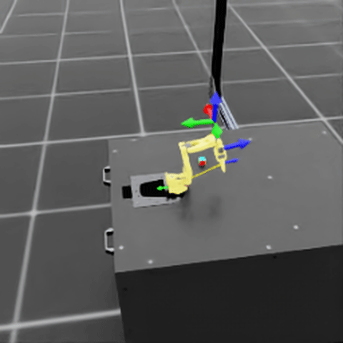

<details>
<summary>Test 1 action log steps 48–74 (radians, post deg→rad conversion). Shows some wild changes in steps 51 and 68.</summary>

```
step 48: action(rad) [ 0.      0.0149  0.0156 -0.0048  0.0443  0.131 ]
step 49: action(rad) [-0.0011  0.0134  0.0147 -0.0102  0.0433  0.1351]
step 50: action(rad) [ 0.0055  0.0038 -0.0015 -0.0123  0.095  -0.0174]
step 51: action(rad) [ 4.00e-03  6.20e-03 -1.00e-04 -1.46e-02  8.89e-02 -1.80e-02]
step 52: action(rad) [ 0.0096  0.0091  0.0086 -0.0215  0.0993 -0.0186]
step 53: action(rad) [ 0.0098  0.0106  0.0136 -0.0208  0.0956 -0.0176]
step 54: action(rad) [ 0.0132  0.012   0.0196 -0.007   0.0839 -0.0174]
step 55: action(rad) [ 0.0116  0.0132  0.0214 -0.0087  0.0847 -0.0171]
step 56: action(rad) [ 0.012   0.0147  0.0224 -0.0093  0.0833 -0.0168]
step 57: action(rad) [ 0.0136  0.014   0.0214 -0.0137  0.0777 -0.0174]
step 58: action(rad) [ 0.017   0.0113  0.0194 -0.0239  0.0748 -0.0177]
step 59: action(rad) [ 0.0217  0.0096  0.0201 -0.029   0.0723 -0.0182]
step 60: action(rad) [ 0.0245  0.0098  0.0204 -0.0316  0.0695 -0.0187]
step 61: action(rad) [ 0.0291  0.0095  0.0202 -0.0373  0.0651 -0.02  ]
step 62: action(rad) [ 0.0307  0.0084  0.0197 -0.0403  0.0636 -0.0197]
step 63: action(rad) [ 0.0318  0.0074  0.0204 -0.0433  0.062  -0.0191]
step 64: action(rad) [ 0.034   0.0053  0.0213 -0.0492  0.0606 -0.0194]
step 65: action(rad) [ 0.037   0.0029  0.0211 -0.0531  0.0595 -0.0194]
step 66: action(rad) [ 0.042   0.0011  0.019  -0.0556  0.0593 -0.0201]
step 67: action(rad) [ 0.045   0.0003  0.0175 -0.0561  0.0585 -0.0198]
step 68: action(rad) [ 5.03e-02 -1.00e-04  1.96e-02 -5.97e-02  5.64e-02 -1.99e-02]
step 69: action(rad) [ 0.0543 -0.0005  0.0199 -0.0632  0.0544 -0.0202]
step 70: action(rad) [ 0.0579 -0.0009  0.0214 -0.0651  0.0517 -0.0203]
step 71: action(rad) [ 0.0594 -0.0013  0.0215 -0.0662  0.0502 -0.0202]
step 72: action(rad) [ 0.0624 -0.002   0.0241 -0.073   0.0499 -0.0199]
step 73: action(rad) [ 0.063  -0.0025  0.0259 -0.0771  0.0489 -0.0196]
step 74: action(rad) [ 0.0642 -0.0024  0.0298 -0.0823  0.0466 -0.0199]
```

</details>


#### Side test: Can I run inference with 3 monitors? 
I recently upgraded my monitor setup and now I'm driving 2x1080p and 1x1440p monitor (3 monitors). This is 1 extra monitor than before but it's negligible. I was able to run inference just fine. The following is what I observed with no scripts running, just hot plugging a monitor.

 Before | After (1x1080p monitor added) | 
|-------|:----------------------:|
| ~1.1/8GB  | ~1.1/8GB | 

### 2026-07-21: Does SmolVLA run better if I change the arm (pt1)
#### Getting the SO-100 robot arm in IsaacLab
SmolVLA was trained on the SO-100 so I'm just starting to match the distribution to get a better result.
I found a community repo that implements tasks for the SO‑ARM100 and SO‑ARM101 robots using Isaac Lab.

Cloned https://github.com/MuammerBay/isaac_so_arm101 . Didn't use uv- I have pip venv set up already for IsaacLab. The repo uses the same Python and IsaacLab versions I'm using which was lucky!

This repo is an external project, meaning it defines its own robot configs, task configs, and scripts in its own package.
I activated my isaaclab venv (`conda activate isaaclab`), installed into my isaaclab venv with `pip install -e . --no-deps` which cleanly allows me to just use my venv's deps for the repo.

I ran `list_envs`

**I learned that the `play` suffix means you're not using this task for training and just for inference.**


I tried to run the task from the repo readme quickstart `Isaac-SO-ARM100-Reach-Play-v0` and it ran successfully. The arms are doing nothing because there's no VLA working with them.:


Quick win for today to just get the right arm into the sim. Tomorrow I'll try to plumb SmolVLA to get the arms moving.

### 2026-07-15: Does SmolVLA run better if I increase scale
Short answer no. I'm able to observe a lot more per session though.

I thought I properly increased scale from 0.05 to 0.1, then 0.5. Turns out I was editing the wrong part of code and I have a bunch of frames for the same scale of 0.01, so I changed their names for future reference- might as well keep them for the sake of learning.
- Created better naming conventions for frames
- Started running IsaacSim not-headless because I have room for it VRAM wise now that I'm using SmolVLA (~6.4/8GB observed peak)

Actually changed scales.
#### Scale factor sweep (instruction: "pick up the blue cube")

| Scale | Cube interaction (Y/N) | Notes |
|-------|:----------------------:|-------|
| 0.05  | N | The arm is just awkwardly moving itself "up"    |
| 0.15  | N | The arm did make a better attempt to move itself down towards the cube but did not meet the EE with the cube. This was the closest it got. |
| 0.5   | N | The arm was just as awkward as the first scale, and this time rotated away from the cube then back down. It was making a lot of adjustments, and it was doing a lot more within the time frame but still did not meet the cube.

| Scale 0.05 | Scale 0.15 | Scale 0.5 |
|--------|---------|---------|
| 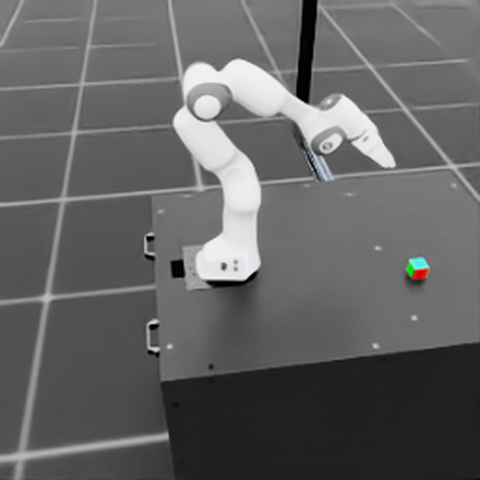 | 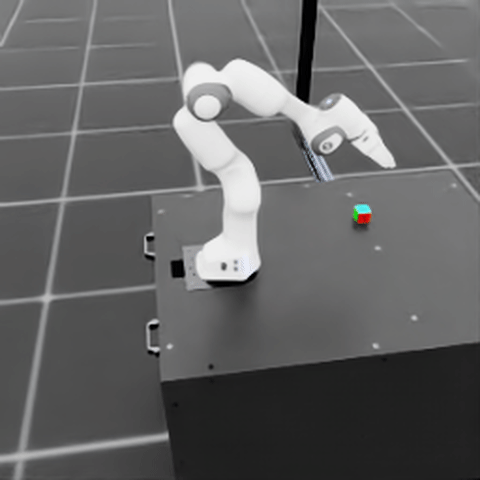 | 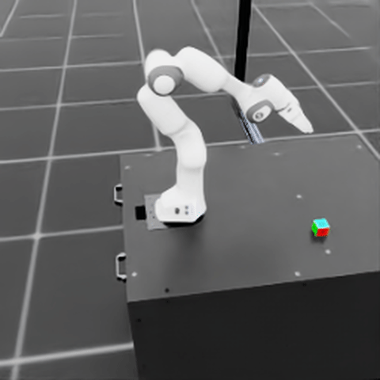


This is the first time I'm seeing that the VLA is doing different solutions every time, not just one solution every time I run it. It's trying different things because a lot of the information I'm giving it is OOD.

Bottom line, this needs:
- I need to actually give joint state back to SmolVLA
- ability to open and close the gripper
- a different arm would be best
- maybe better camera angles or just more cameras given that SmolVLA would do well with 3 inputs


### 2026-07-11: It's aliiiiive! Success: Closed loop SmolVLA driving IsaacSim Franka arm on RTX 3070 8GB
I successfully ran inference closed loop, demonstrating the architecture end to end.

IsaacSim takes a "photo" of the simulated Franka arm on a table with a cube -> POSTs image to SmolVLA server -> server processes one image at a time through SmolVLA -> server spat out an action back to IsaacSim client-> IsaacSim received the action -> bot moves -> start loop again.

I can see the arm moving subtly by moving through the saved images in this project (see below)

#### VLA + IsaacSim finally fit on RTX 3070 8GB

| Configuration                              | VRAM (observed peak) | Result            |
|--------------------------------------------|----------------------|-------------------|
| OpenVLA (4-bit) server + Isaac Sim headless | 7.2 / 8.2 GB         | Crash (OOM)       |
| SmolVLA server alone                        | 1.9 / 8.2 GB         | —                 |
| SmolVLA server + Isaac Sim headless         | 5.8 / 8.2 GB         | Closed loop runs  |

#### Commands
Assume cd into project root.
1. Activate server in terminal: `conda activate lerobot` then `python scripts/smolvla_server.py`
2. Activate IsaacSim in another terminal: `conda activate isaaclab` then `python scripts/closed_loop_smolvla.py`

#### Some things I need to address
1. The Franka arm isn't the best choice for SmolVLA; SmolVLA outputs joint-space commands for an SO-100 which I feed into an EE-delta (IK-Rel) interface on a Franka.
2. Camera placement; SmolVLA wants 3 camera inputs and one of them is egocentric on the EE; I'm using a weird angle (see frames below).
3. Number of cameras; I'm only simulating one camera, so I duplicate the frame to fill in the other two expected camera frames.
4. SmolVLA wants 6DOF joint state as part of it's input; I am not giving any state and just zeroing all that out.
5. No fine tuning (not a hack but will help immensely)
6. The arm moves slowly in observation; scale factor 0.05 in closed_loop.py; try 0.1-0.2.
7. The full 200 step run took around 5s which when I asked Claude about this, it flags as unusually fast for that many inferences. Investigate this.

#### Closed-loop frame sequence (every 20 steps, instruction: "pick up the blue cube")
This only ran for around 5 seconds. Next step is to either speed things up by adjusting a scale or sensitivity, or let it run longer. SmolVLA's 6 outputs -> first 6 dims of the 7-dim IK-Rel action × 0.05, gripper pinned open.

| Step 0 | Step 20 | Step 40 | Step 60 | Step 80 |
|--------|---------|---------|---------|---------|
| 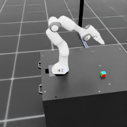 | 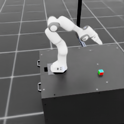 | 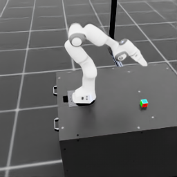 | 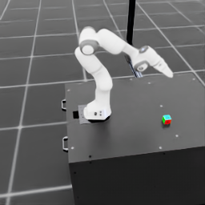 | 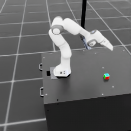 |

| Step 100 | Step 120 | Step 140 | Step 160 | Step 180 |
|----------|----------|----------|----------|----------|
| 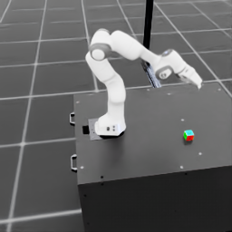 | 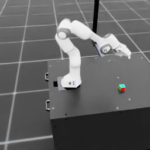 | 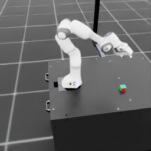 | 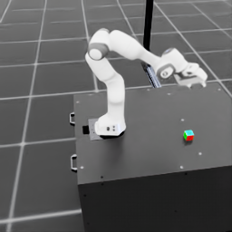 | 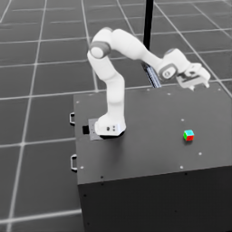 |

### 2026-07-10: Attempted closed loop OpenVLA; pivot to SmolVLA due to GPU mem constraint (8GB)
##### Biggest finding: SmolVLA takes up significantly less VRAM on my RTX 3070: 2047MiB / 8192MiB observed peak when running inference!
I attempted to get a basic flask server running to get a closed loop inference on quantized (4bit) OpenVLA with IsaacSim Franka and a cube. This failed because I kept running into memory issues having the quantized model running then attempting to run a headless IsaacSim instance to give the model server a frame to analyze. I even dumbed down the simulated camera resolution to 256x256, unplugged all but one monitor, closed all unnecessary apps, and it still wasn't enough. I made the decision to try and move to SmolVLA which should be better given that it seems to have been made with consumer hardware memory constraints in mind.
- With quantized OpenVLA server running and headless IsaacSim, it takes up around 7.2/8.2GB on my RTX 3070 and that's including the fact that IsaacSim returns failures. Maybe it would be even more if it had the room.
- I'm still going to have a local server running to get this to work closed-loop; flask server running the VLA <--> IsaacSim Franka with cube

#### SmolVLA inference success
##### Biggest finding: SmolVLA takes up significantly less VRAM on my RTX 3070: 2047MiB / 8192MiB observed peak when running inference!
I configured a conda env for SmolVLA and got it inferring from the same simulated frame I was using on OpenVLA the other day. It returns a 6 DOF joint space action. I'll have to adjust the workflow though because SmolVLA has different inputs/outputs than OpenVLA:
- SmolVLA likes an input of a 3-item dict; [3 camera frames, 6DOF joint state, instruction] which is different than what OpenVLA wanted; [1 camera frame, instruction]
- SmolVLAs output is also a 6DOF joint state that it post processes to a tensor

I ran a SmolVLA test on the same image from last time when I got OpenVLA inferring on an IsaacSim image: 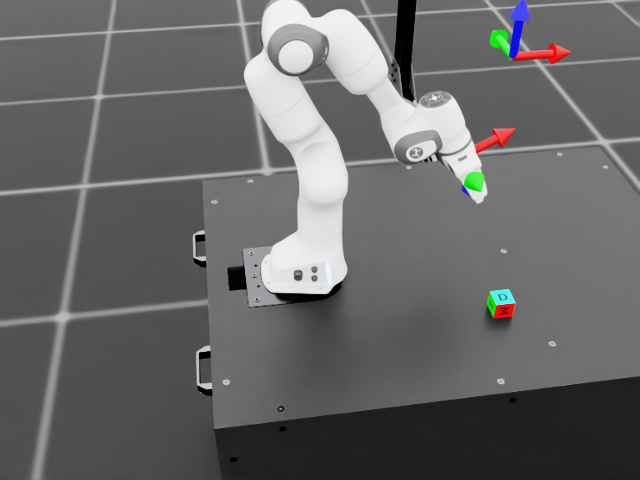

It gave the following output: `torch.Size([1, 6]) tensor([[ 0.0941, -0.0266,  0.1428, -0.2455,  0.1304,  0.5694]])`
I used smolvla_test.py which was developed with Claude as I figured out how to trick SmolVLA into thinking it's getting 3 camera feed frames when I'm only giving it one.

Next step is closed loop with IsaacSim!

### 2026-07-08: Ran OpenVLA inference on IsaacSim simulated frame
 Grabbed a tutorial script from IsaacLab that shows how to get sensors to work, created `capture_frame.py` to get IsaacSim to simulate a Franka arm with a cube on a table, then set the camera to save a frame to the project. Then ran the inference to pull the frame and determine a movement tensor to pick up the cube.
 - Had to do a lot of fussing with the simulated camera (why does it ship with such high sensitivity when navigating the 3D world?!)
 - Had to realize that OpenVLA was trained on a certain angle for the camera meaning an optimal location was a good idea
 - Running the sim headless was best for my poor GPU
 - Changed the inference code prompt to `prompt = "In: Pick up the blue cube\nOut:"` even though the cube is actually multicolored, I just wanted to see what would happen. I got back an action tensor successfully, I just don't know what that would look like. (Predicted 7-DOF action: [-0.00065614 -0.0111082  -0.00154037  0.01391019  0.02668386 -0.05970324 0.])

 Achieved:
 Isaac Lab scene in Isaac Sim -> camera frame -> OpenVLA -> 7 DOF action tensor

### 2026-07-07: Ran OpenVLA inference (quantized for my RTX3070) on real photo; SmolVLA is next to compare
Loaded up and ran inference on OpenVLA (quantized so it fits on my 3070). Giving it a real image of a cup on my desk and then later comparing it to SmolVLA which fits better on my GPU.
- Had to fuss with a lot of mismatched libraries because I was trying to run a quantized model from 2024 on libraries from now.
- Worked with Claude to find that OpenVLA actually recommends to just have a dedicated conda env for era-correct libs
- Discovered that inputs need to match the weights (in my case my processor was creating an image tensor in 32 when the model weights are set to 16)
- Learned a bunch of things in the process so I'm blurry on some things like timm, how bitsandbytes works....

I used the prompt `prompt = "In: What action should the robot take to pick up the mug?\nOut:"` and got the output `Predicted 7-DOF action: [ 1.48869192e-05 -1.95259519e-02  1.83735840e-03  1.51873807e-02
 -5.10204509e-02 -9.51627977e-02  9.96078431e-01]` when I gave it a sample image of my nasa mug on my table.

 I'll need to figure out exactly what each number means.

 A few notes:
 OpenVLA inference runs in a separate openvla conda env (Python 3.10) with era-pinned libraries — see requirements-openvla.txt.

### 2026-07-03: PyTorch quickstart completed
Worked through the PyTorch quickstart tutorial (FashionMNIST classifier).
Built conceptual understanding of:
- Model definition with nn.Module, forward pass, and layer stacking
- Weights vs. biases and how each is learned via gradient descent
- Cross-entropy loss and softmax for classification
- Training vs. evaluation modes, batch size, epochs
- Why VRAM matters and how parameters map to memory

### 2026-5-24: Initial environment setup
- Ubuntu 22.04 dual-boot completed
- NVIDIA driver 580 verified via `nvidia-smi`
- conda + Python 3.11 env created (`isaaclab`)
- PyTorch CUDA confirmed: `torch.cuda.is_available() == True`, RTX 3070 detected
- Isaac Sim 5.1.0 installed via pip
- Isaac Lab cloned and installed
- Smoke test passed: `Isaac-Lift-Cube-Franka-v0` task launches and runs RL training
- Known noise: pip dependency conflicts on psutil, click, torchaudio — not blocking
- Observation: Isaac Sim startup is heavy on 3070; reducing monitor count helps